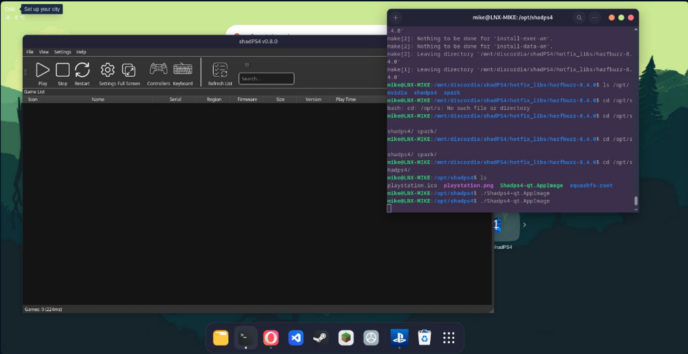

# Build shadPS4 for Linux

Este README está hecho con el contenido del `repositorio oficial` del emulador [ShadPS4](https://github.com/shadps4-emu/shadPS4)
Aquí pondré todo el código y el proceso que me ha servido a mi para poder instalar el emulador en `Debian 12`

## Instalación de dependencias

primero de todo necesitamos instalar todos estos paquetes
```bash
sudo apt install build-essential clang git cmake libasound2-dev \
    libpulse-dev libopenal-dev libssl-dev zlib1g-dev libedit-dev \
    libudev-dev libevdev-dev libsdl2-dev libjack-dev libsndio-dev \
    qt6-base-dev qt6-tools-dev qt6-multimedia-dev libvulkan-dev \
    vulkan-validationlayers libpng-dev
```

luego clonamos el repositorio oficial 
```bash

git clone --recursive https://github.com/shadps4-emu/shadPS4.git
cd shadPS4
```
### troubleshooting

me he encontrado con problemas en la construcción (el siguiente paso) los cuales he resuelto actualizando `gcc` a la versión 13 necesitando añadir el repositorio testing al sistema:
```bash
sudo nano /etc/apt/sources.list
# debes añadir 'testing' a la lista de repositorios tal que así:
# deb http://deb.debian.org/debian testing main
```
luego ya actualizamos la lista de paquetes:
```bash
sudo apt update
```

una vez hemos actualizado el sistema, instalamos `g++-13`:
```bash
sudo apt install -t testing g++-13
```

## Constructor mediante terminal

vamos a generar el directorio de construcción dentro del propio directorio del repositorio que hemos clonado
```bash
cmake -S . -B build/ -DENABLE_QT_GUI=ON -DCMAKE_C_COMPILER=clang -DCMAKE_CXX_COMPILER=clang++
```
Ahora usamos `cmake` para construir el propio proyecto
```bash
cmake --build ./build --parallel$(nproc)
```

> Si se te congela el equipo durante la construcción, el repositorio oficial alerta que puede ser por un alto uso de recursos, en tal caso ejecutad el comando anterior sin el parametro `--parallel$(nproc)`

Una vez se haya terminado de montar, ejecutamos el emulador
```bash
./build/shadps4
```
si la ruta donde tenemos los juegos es otra, lo ejecutamos de esta forma:
```bash
./build/shadps4 /"PATH"/"TO"/"GAME"/"FOLDER"/eboot.bin
```

## Alternativa: web oficial

si el repositorio y el montaje dan demasiados problemas, está como alternativa la web oficial de [shadPS4](https://shadps4.net/downloads/) donde podremos descargar un zip que contiene una imagen ejecutable.

cuando lo tengamos ejecutamos:
```bash
unzip unzip shadps4-linux-qt-0.8.0.zip
# Atentos a la versión descargada, en mi caso es la 0.8.0
```
y luego podemos iniciarlo con
```bash
./Shadps4-qt.AppImage
```

### Añadir al escritorio

si queremos que además de ejecutarlo mediante este método podamos añadirlo al escritorio, vamos a hacer lo siguiente:
- lo movemos a `/opt`
```bash
sudo mkdir /opt/shadps4
sudo mv Shadps4-qt.AppImage /opt/shadps4/Shadps4-qt.AppImage
```
- le damos `permisos de ejecución` a la imagen
```bash
sudo chmod +x /opt/shadps4/Shadps4-qt.AppImage
```
- vamos a descargar un `icono` para ponerle
```bash
sudo mv ~/Descargas/playstation.png /opt/shadps4/
```
- creamos un archivo `shadps4.desktop`
```bash
nano ~/.local/share/applications/shadps4.desktop

# el contenido del archivo será el siguiente
[Desktop Entry]
Name=ShadPS4
Exec=/opt/shadps4/Shadps4-qt.AppImage
Icon=/opt/shadps4/playstation.png
Type=Application
Categories=Utility;
```
- actualizamos la base de datos de `accesos directos`:
```bash
update-desktop-database ~/.local/share/applications/
```

## Compatibilidad de librerías

Me he encontrado con algunos problemas a la hora de trabajar con librerías. 

El problema se arregló instalando una instancia de la librería dentro de la carpeta donde guardo los archivos de shadPS4 en `/mnt/d/shadps4/hotfix_libs`. en ese directorio he instalado dos librerías que me daban problemas:

### 1. **Librería `FreeType`**

Aunque este problema vino después, lo voy a poner primero ya que la siguiente librería depende de esta para poder ejecutar la imagen correctamente.

Esta librería contiene funciones que necesita la librería `Harfbuzz` para poder funcionar correctamente con shadPS4, lo que hace necesario empezar por aquí.

primero obtenemos el comprimido:
``` bash
wget https://download.savannah.gnu.org/releases/freetype/freetype-2.13.2.tar.gz
```

luego lo descomprimimos y nos movemos al directorio para montarlo:
```bash
tar -xf freetype-2.13.2.tar.gz
cd freetype-2.13.2
```

configuramos `freeType` para que se instale en su propio subdirectorio:
```bash
./configure --prefix=/mnt/discordia/shadPS4/hotfix_libs/freetype-2.13.2/INSTALLED
```

compilamos e instalamos:
```bash
make -j$(nproc)
make install
```

#### Preparamos el entorno para usar la siguiente librería
```bash
export PKG_CONFIG_PATH=/mnt/discordia/shadPS4/hotfix_libs/freetype-2.13.2/INSTALLED/lib/pkgconfig
```
verificamos con:
```bash
pkg-config --modversion freetype2
```
### 2. **Librería `Harfbuzz`**

Continuando por la librería `Harfbuzz`, la versión de mi sistema era la `2.6` mientras que shadPS4 necesita como mínimo la `4.0`. Actualizar la librería generaba conflictos en mi sistema por lo que opté por instalar una instancia nueva y decirle a la imagen de ejecución que usara los archivos de esa instancia en vez de los que hay en el sistema.

primero obtenemos el comprimido:
``` bash
wget https://github.com/harfbuzz/harfbuzz/releases/download/8.4.0/harfbuzz-8.4.0.tar.xz
tar -xf harfbuzz-8.4.0.tar.xz
```

luego lo descomprimimos y nos movemos al directorio para montarlo:
```bash
tar -xf harfbuzz-8.4.0.tar.xz
cd harfbuzz-8.4.0
```

ahora configuramos la librería usando las dependencias de `freeType`:
```bash
./configure --prefix=/mnt/discordia/shadPS4/hotfix_libs/harfbuzz-8.4.0/INSTALLED --with-freetype=yes
```

compilamos e instalamos:
```bash
make -j$(nproc)
make install
```

# Resultado final:

